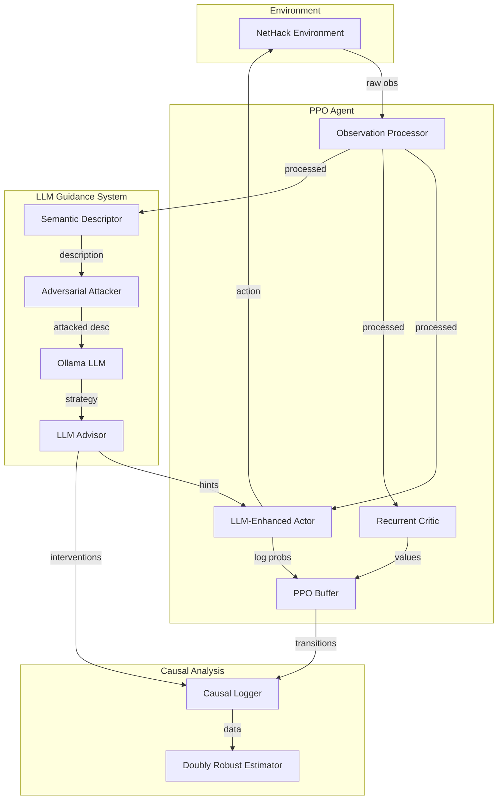

# CausalRLAgent Architecture

System architecture for the LLM-guided PPO agent with adversarial robustness testing and causal analysis.

---

## System Overview



---

## Core Components

### 1. PPO Training Pipeline

| Component             | File                 | Purpose                                      |
| --------------------- | -------------------- | -------------------------------------------- |
| `LLMEnhancedPPOActor` | `causal_filtered.py` | Policy network with LLM guidance integration |
| `RecurrentPPOCritic`  | `causal_filtered.py` | Value network with LSTM                      |
| `RecurrentNetHackCNN` | `causal_filtered.py` | CNN + LSTM for glyph processing              |
| `PPOBuffer`           | `causal_filtered.py` | Experience replay with GAE computation       |
| `NetHackRewardShaper` | `causal_filtered.py` | Reward shaping (exploration, health, level)  |

### 2. LLM Guidance System

| Component                   | File                 | Purpose                                |
| --------------------------- | -------------------- | -------------------------------------- |
| `NetHackSemanticDescriptor` | `causal_filtered.py` | Converts game state → natural language |
| `EnhancedLLMAdvisor`        | `causal_filtered.py` | Calls Ollama API for strategic advice  |
| `AdversarialLLMAdvisor`     | `causal_filtered.py` | Advisor with attack injection          |
| `AdversarialAttacker`       | `causal_filtered.py` | 7 attack types on descriptions         |

### 3. Causal Analysis Pipeline

| Component               | File                 | Purpose                             |
| ----------------------- | -------------------- | ----------------------------------- |
| `ImprovedCausalLogger`  | `causal_logger.py`   | Logs treated/control observations   |
| `DoublyRobustEstimator` | `causal_analysis.py` | Propensity score + outcome modeling |

---

## Data Flow

### Training Loop

```
1. env.reset() → raw_obs
2. obs_processor.process(raw_obs) → tensor_obs
3. semantic_descriptor.describe(raw_obs) → description
4. [optional] attacker.attack(description) → attacked_description
5. ollama.generate(attacked_description) → strategy
6. advisor.to_hints(strategy) → action_hints
7. actor.forward(tensor_obs, action_hints) → action_logits
8. sample(action_logits) → action
9. env.step(action) → next_obs, reward, done
10. buffer.add(obs, action, reward, ...)
11. logger.log_step(step_data)
12. [periodic] agent.update() via PPO
```

### Causal Logging

Every step logs:

- **Identifiers**: global_step, episode, step
- **State features**: health_ratio, level, depth, gold
- **Action/outcome**: action, reward, shaped_reward, value
- **Treatment indicator**: `treated` (bool), `treatment_strength` (float)

LLM interventions additionally log:

- **Pre-treatment context**: recent actions, rewards, health
- **Treatment details**: semantic description, LLM response, parsed strategy
- **Post-treatment outcomes**: immediate (10 steps), short-term (50), long-term (100)

---

## Key Abstractions

### Observation Processing

```python
NetHackObservationProcessor:
  Input:  raw NetHack observation dict
  Output: {
    'glyphs':         (21, 79) normalized glyph tensor
    'stats':          (26,) blstats vector
    'message':        (256,) encoded message
    'inventory':      (55,) inventory features
    'action_history': (50,) recent action encoding
  }
```

### LLM Hints

```python
Action hints: np.array of shape (23,)
  - 0.0 = no boost
  - 0.2+ = boost this action

Strategies: 'explore', 'combat', 'retreat', 'collect', 'wait'
```

### Treatment Effect

```python
DoublyRobustEstimator computes:
  ATE = E[Y(1) - Y(0)]  # Average Treatment Effect

  Where:
    Y(1) = outcome if LLM guidance active
    Y(0) = outcome if no LLM guidance
```

---

## File Map

```
PPO_Agent/
├── causal_filtered.py      # Main agent, attacks, advisor (4145 lines)
├── adversarial_attacks.py  # Attack framework (3269 lines)
├── causal_analysis.py      # DoublyRobustEstimator (638 lines)
├── causal_logger.py        # Treatment/control logging (733 lines)
├── agent.py                # Base PPO agent
└── *.json                  # Experiment results
```

---

## Configuration

### Agent Parameters

```python
LLMEnhancedNetHackAgent(
    action_dim=23,              # NetHack action space
    learning_rate=1e-4,         # Adam optimizer LR
    gamma=0.99,                 # Discount factor
    clip_ratio=0.2,             # PPO clipping
    entropy_coef=0.02,          # Entropy bonus
    enable_llm=True,            # Enable LLM guidance
    llm_guidance_weight=0.05,   # How much LLM influences policy
)
```

### Attack Parameters

```python
AdversarialAttacker(
    attack_type=AdversarialAttackType.STRATEGIC_POISONING,
    attack_strength=0.5,  # 0.0 to 1.0
)
```

### Causal Logger Parameters

```python
ImprovedCausalLogger(
    log_dir="causal_logs_v2",
    window_size=50,  # Steps for outcome windows
)
```
