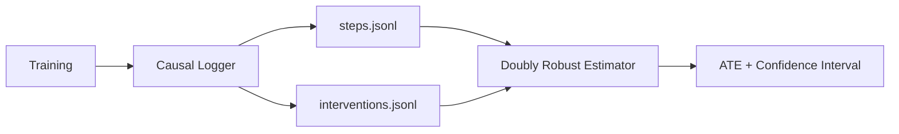

# Causal Analysis Pipeline

Guide to understanding and running causal analysis on LLM-guided RL experiments.

---

## Conceptual Framework

### Treatment and Control

| Concept         | Definition                                                 |
| --------------- | ---------------------------------------------------------- |
| **Treatment**   | Steps where LLM guidance was active                        |
| **Control**     | Steps without LLM guidance                                 |
| **Outcome**     | `shaped_reward` (or other metrics)                         |
| **Confounders** | Game state features that affect both treatment and outcome |

### The Causal Question

> Does receiving LLM strategic advice **cause** better performance?

Simple comparison (treated vs control) is biased because the agent is more likely to call the LLM when struggling. The causal analysis corrects for this selection bias.

---

## Pipeline Overview



---

## Step 1: Logging During Training

The `ImprovedCausalLogger` records every step:

```python
from causal_logger import ImprovedCausalLogger

logger = ImprovedCausalLogger(log_dir="causal_logs_v2", window_size=50)

# Every step:
logger.log_step({
    'episode': 0,
    'step': 10,
    'raw_obs': raw_obs,
    'action': action,
    'reward': reward,
    'shaped_reward': shaped_reward,
    'value': value,
    'done': done,
    'llm_treatment': True,       # Was LLM active?
    'llm_hint_strength': 0.2,    # Guidance magnitude
})

# When LLM is called:
logger.log_llm_intervention({
    'episode': 0,
    'step': 10,
    'semantic_description': "...",
    'llm_response': "explore",
    'parsed_strategy': "explore",
    'action_hints': hints,
    'boosted_actions': [0, 1, 2],
    'call_duration': 0.5,
    'performance_before': {'avg_reward': 5.0},
    'raw_obs': raw_obs,
})
```

### Output Files

| File                    | Format | Contents                       |
| ----------------------- | ------ | ------------------------------ |
| `steps_*.jsonl`         | JSONL  | Every step (treated + control) |
| `interventions_*.jsonl` | JSONL  | LLM calls with context         |
| `summary_*.json`        | JSON   | Aggregated statistics          |

---

## Step 2: Running the Estimator

```python
from causal_analysis import DoublyRobustEstimator

estimator = DoublyRobustEstimator(
    steps_file="causal_logs_v2/steps_20251101_222630.jsonl",
    interventions_file="causal_logs_v2/interventions_20251101_222630.jsonl"
)

results = estimator.run_full_analysis()
```

### What the Estimator Does

1. **Load data** from JSONL files
2. **Prepare features**: health, level, depth, reward history, episode progress
3. **Estimate propensity scores**: P(Treatment | Features)
4. **Estimate outcome models**: E[Reward | Features, Treatment]
5. **Compute Doubly Robust ATE**: Combines both models for robustness
6. **Analyze heterogeneity**: Effect varies by game state
7. **Visualize results**: Generate plots

---

## Step 3: Understanding the Output

### Main Result: ATE

```
📊 DOUBLY ROBUST RESULTS:
   ATE: 0.001234
   Standard Error: 0.000567
   95% CI: [-0.000123, 0.002591]
   P-value: 0.0523
   Significant: NO ✗
```

| Metric          | Interpretation                                    |
| --------------- | ------------------------------------------------- |
| **ATE**         | Average effect of LLM on `shaped_reward` per step |
| **95% CI**      | Range where true effect likely lies               |
| **Significant** | Does CI exclude zero?                             |

### Interpretation Guide

| ATE Value | CI         | Conclusion   |
| --------- | ---------- | ------------ |
| Positive  | Excludes 0 | LLM helps ✅ |
| Positive  | Includes 0 | Inconclusive |
| Negative  | Excludes 0 | LLM hurts ❌ |
| Near zero | -          | No effect    |

---

## Heterogeneous Effects

The estimator analyzes if treatment effects vary:

### By Episode Progress

```
📊 Treatment Effect by Episode Progress:
   Early      : ATE=+0.002345 ±0.000123 (n=10000) ✓
   Mid-Early  : ATE=+0.001234 ±0.000234 (n=12000) ✓
   Mid-Late   : ATE=-0.000456 ±0.000345 (n=11000) ✗
   Late       : ATE=-0.001234 ±0.000456 (n= 8000) ✓
```

**Interpretation**: LLM helps early in episodes but may hurt late.

### By Health Status

```
📊 Treatment Effect by Health:
   Low    : ATE=+0.005000 ±0.000234 ✓  # LLM helps when struggling
   Medium : ATE=+0.001000 ±0.000345 ✗
   High   : ATE=-0.001000 ±0.000456 ✗  # LLM unnecessary when healthy
```

### By Recent Performance

```
📊 Treatment Effect by Recent Performance:
   Struggling : ATE=+0.003000  # LLM helps most here
   Doing-Well : ATE=-0.001000  # LLM may interfere
```

---

## Visualization Outputs

The estimator generates:

1. **`doubly_robust_analysis.png`**
   - Propensity score distribution (overlap check)
   - ITE distribution histogram
   - Effect by episode progress
   - Effect by recent performance

2. **`heterogeneous_effects.png`**
   - 6 subplots showing effects by different dimensions
   - Color-coded (red=negative, green=positive)

3. **`strategy_effectiveness.png`**
   - Performance by LLM strategy type
   - Strategy usage distribution

---

## Common Issues

### Poor Overlap

If propensity scores are extreme (all near 0 or 1):

- Treatment is too rare or too common
- Solution: Adjust LLM call frequency

### No Significant Effect

If CI includes zero:

- More data needed
- LLM may genuinely have no effect
- Effect may be masked by heterogeneity

### Negative Effect

If ATE is significantly negative:

- LLM advice is hurting performance
- Reduce `llm_guidance_weight`
- Review attack contamination

---

## API Reference

### DoublyRobustEstimator

```python
class DoublyRobustEstimator:
    def __init__(self, steps_file, interventions_file, summary_file=None)

    def run_full_analysis(self) -> dict:
        """Complete analysis pipeline. Returns:
        {
            'ate': float,
            'se': float,
            'ci_lower': float,
            'ci_upper': float,
            'p_value': float,
            'significant': bool
        }
        """

    def visualize_results(self, output_dir='causal_analysis'):
        """Generate PNG visualizations"""
```

### ImprovedCausalLogger

```python
class ImprovedCausalLogger:
    def __init__(self, log_dir="causal_logs_v2", window_size=50)

    def log_step(self, step_data: dict)
    def log_llm_intervention(self, intervention_data: dict) -> int
    def compute_causal_estimates(self) -> dict
    def save_summary(self) -> dict
```
